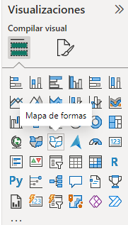
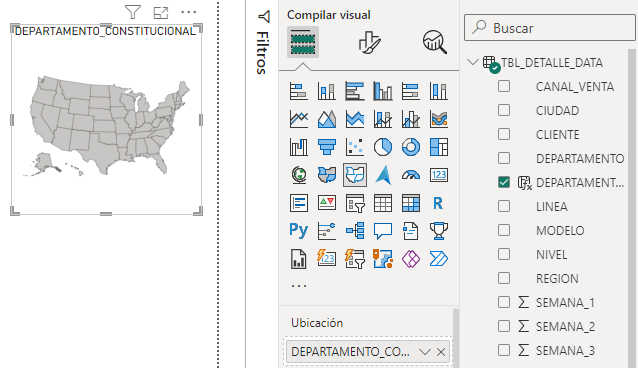
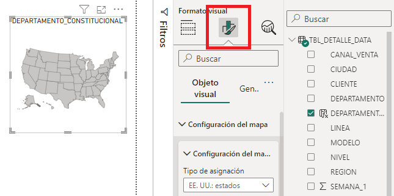
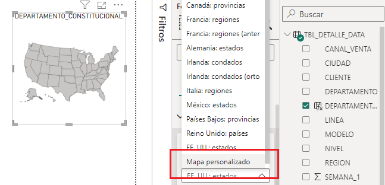
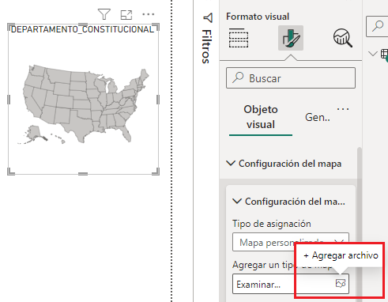
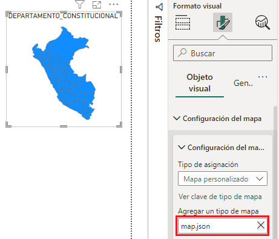
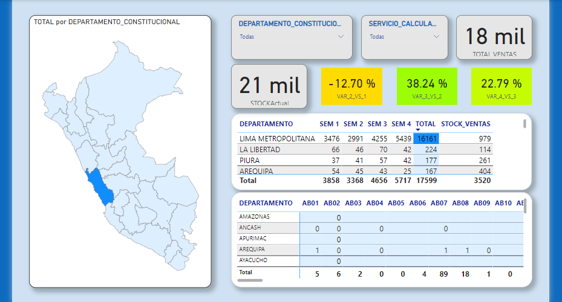
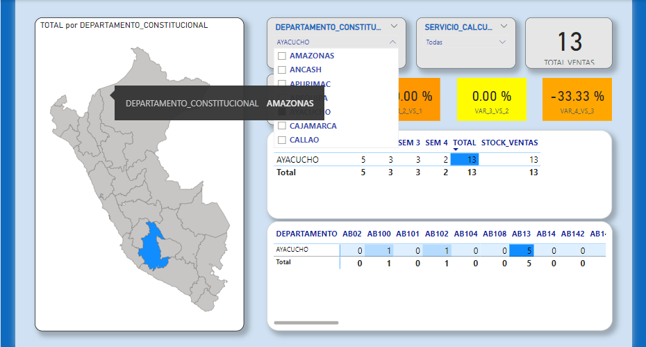
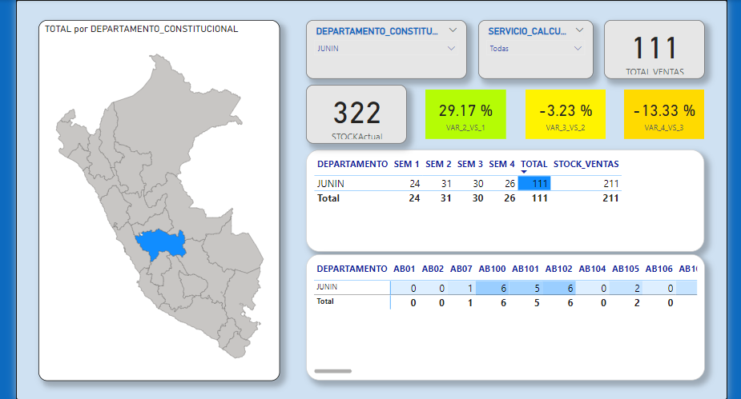

# DashBoard Power BI - Maps ".json"

Using:
* Power BI
* Map.JSON
* DAX
* Blocks Graphs
* Lineal Graphs

## Configuration

### Init

* Step 01:
  Select Form Maps

  

* Step 02:
  Select Data column "Map"

  

* Step 03:

  

* Step 04:

  

* Step 05: Load "Map.json"

  

* Step 06:

  

****
## Views

#### General Map

****
#### Filter Map 01

****
#### Filter Map 02

